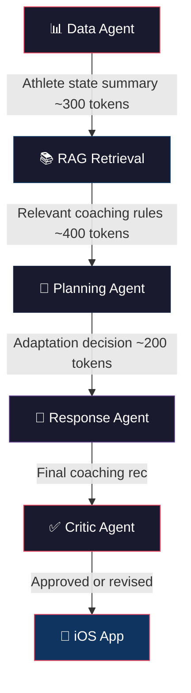

# Adaptive Triathlon Coach — Implementation Plan (v3)

## Overview

An iOS-first adaptive triathlon coaching app. The intelligence layer is the product — not a workout logger, not a Strava clone. The system adapts coaching recommendations in real-time based on COROS Pace 3 wearable data, athlete feedback, and accumulated fatigue context, powered by a local LLM with triathlon-specific knowledge.

---

## User Review Required

> [!IMPORTANT]
> **LLM model choice updated.** Based on your Mac hardware (M3 Pro, 18GB) and research into 2026 model options, the recommendation has changed from Llama 3.1 8B to **Qwen3 8B** or **GPT-OSS 20B**. See detailed comparison below.

---

## LLM Model Selection — Detailed Analysis

### Your Hardware Constraint: MacBook Pro M3 Pro, 18GB Unified Memory

This is the single most important constraint. With 18GB total (shared between OS, apps, and LLM), we realistically have **~12–14GB available for model inference**. This means:
- ✅ 7B–8B models at Q8 quantization (high quality) — ~8–9GB
- ✅ 14B models at Q4 quantization — ~8–10GB
- ⚠️ 20B MoE models at Q4 — ~12GB (tight but possible, only 3.6B active params)
- ❌ 30B+ dense models — won't fit comfortably
- ❌ Llama 4 Scout (109B MoE) — needs 64GB, way out of range

### Model Comparison for Our Use Case

Our coaching agent needs:
1. **Strong reasoning** — deciding when/how to adapt workouts based on fatigue signals
2. **Reliable structured output** — producing JSON coaching recommendations for the app
3. **Good instruction following** — respecting the system prompt persona and coaching rules
4. **Domain grounding via RAG** — using retrieved triathlon knowledge, not hallucinating

| Model | Params | RAM (Q4) | Reasoning | Structured Output | Instruction Following | Best For | Runs on Your Mac? |
|---|---|---|---|---|---|---|---|
| **Qwen3 8B** | 8B | ~5GB | ⭐⭐⭐⭐⭐ | ⭐⭐⭐⭐⭐ | ⭐⭐⭐⭐⭐ | Agent workflows, thinking mode, tool-calling | ✅ Excellent |
| **Phi-4 14B** | 14B | ~8GB | ⭐⭐⭐⭐⭐ | ⭐⭐⭐⭐ | ⭐⭐⭐⭐ | Reasoning-heavy tasks at small size | ✅ Good |
| **Llama 3.1 8B** | 8B | ~5GB | ⭐⭐⭐⭐ | ⭐⭐⭐⭐ | ⭐⭐⭐⭐ | General-purpose, huge ecosystem | ✅ Excellent |
| **GPT-OSS 20B** | 20B MoE (3.6B active) | ~12GB | ⭐⭐⭐⭐⭐ | ⭐⭐⭐⭐⭐ | ⭐⭐⭐⭐⭐ | Tool-calling, agentic pipelines | ⚠️ Tight (12GB) |
| **Gemma 4 27B** | 27B | ~16GB | ⭐⭐⭐⭐⭐ | ⭐⭐⭐⭐ | ⭐⭐⭐⭐⭐ | High-quality reasoning | ❌ Too large |
| **Qwen3 30B** | 30B MoE | ~18GB | ⭐⭐⭐⭐⭐ | ⭐⭐⭐⭐⭐ | ⭐⭐⭐⭐⭐ | Best-in-class reasoning | ❌ Too large |

### Recommendation: Start with **Qwen3 8B**, benchmark **GPT-OSS 20B**

**Why Qwen3 8B over Llama 3.1 8B (my original suggestion)?**

| Aspect | Llama 3.1 8B | Qwen3 8B | Winner |
|---|---|---|---|
| Reasoning / chain-of-thought | Good general reasoning | Built-in `<think>` mode — explicitly reasons before answering | **Qwen3** |
| Structured JSON output | Reliable with prompting | Optimized for schema-constrained output | **Qwen3** |
| Tool/function calling | Basic support | Native tool-calling, designed for agents | **Qwen3** |
| Multilingual | Strong English | 100+ languages (irrelevant for us, but free) | Tie |
| Community / ecosystem | Largest ecosystem | Fast-growing, Ollama first-class support | Llama (slight edge) |
| RAM usage | ~5GB Q4 | ~5GB Q4 | Tie |
| Speed on M3 Pro | ~30 tok/s | ~30 tok/s | Tie |

**Qwen3 8B is the clear winner for agent-style workloads.** Its built-in thinking mode means the model will reason through "should I lower this workout intensity?" before producing the answer — exactly what our coaching agent needs.

**GPT-OSS 20B as stretch goal:** OpenAI's first open-weight model uses MoE (only 3.6B params active per token despite being 20B total), so it's efficient. At ~12GB Q4, it's tight on your 18GB Mac but potentially feasible. We'll benchmark it — if it fits, it's likely the highest quality option. If it causes memory pressure, we fall back to Qwen3 8B.

### Knowledge Assurance Strategy

> [!IMPORTANT]
> **"How do we know the model has real triathlon coaching knowledge?"**
> We **don't trust the model's base knowledge** for coaching. Instead, we force it to reason only from:
> 1. **Retrieved triathlon coaching documents** (RAG — fed into every prompt from a curated knowledge base)
> 2. **Structured coaching rules** (hard-coded in the system prompt, not left to the model to "remember")
> 3. **Real athlete data** (the model gets your actual numbers, not generic advice)
>
> The model's job is **reasoning over data + knowledge**, not being a triathlon encyclopedia from training data.

### Knowledge Base Sources (RAG)
We will curate and embed these into ChromaDB:
- Joe Friel: *The Triathlete's Training Bible* — periodization, zone-based training, race preparation
- TrainingPeaks methodology — CTL/ATL/TSB framework, performance management charts
- Published interval training protocols — VO2max, threshold, tempo, endurance sessions
- HR zone definitions (Friel 7-zone, Coggan power zones for cycling)
- Recovery science — HRV interpretation, overreaching vs. overtraining markers
- Swim-specific: CSS testing, stroke rate optimization, drill progressions
- Brick session methodology — bike-to-run transition training
- Tapering protocols — race-week load reduction strategies
- **Your own coaching patterns** (over time, the system learns what works for YOU)

---

## Revised Architecture

```
┌─────────────────────────────────────────────────────┐
│           iOS App (SwiftUI + SwiftData)             │
│  ┌──────────────┐ ┌────────────┐ ┌───────────────┐ │
│  │  Today View  │ │ Coach Chat │ │  Feedback Log │ │
│  └──────────────┘ └────────────┘ └───────────────┘ │
│  ┌──────────────────────────────────────────────┐   │
│  │    Coach Analytics Dashboard (in-app)        │   │
│  └──────────────────────────────────────────────┘   │
│  ↕ SwiftData (local cache — always works offline)   │
│  ↕ Pull-to-refresh triggers sync + new coaching rec │
└─────────────────────────────────────────────────────┘
         ↕ HTTP (local network, on-demand)
┌─────────────────────────────────────────────────────┐
│         Mac Data & Intelligence Backend             │
│  ┌──────────────────┐  ┌────────────────────────┐  │
│  │   Ollama LLM     │  │   SQLite Database      │  │
│  │  (Qwen3 8B)      │  │   (all athlete data)   │  │
│  └──────────────────┘  └────────────────────────┘  │
│  ┌──────────────────┐  ┌────────────────────────┐  │
│  │  Multi-Agent     │  │  COROS Training Hub    │  │
│  │  Coaching System │  │  Scraper (Playwright)  │  │
│  └──────────────────┘  └────────────────────────┘  │
│  ┌──────────────────┐  ┌────────────────────────┐  │
│  │  ChromaDB        │  │  FIT File Bulk         │  │
│  │  (Knowledge RAG) │  │  Importer              │  │
│  └──────────────────┘  └────────────────────────┘  │
└─────────────────────────────────────────────────────┘
         ↕ (FIT upload + COROS web scrape)
┌─────────────────────────────────────────────────────┐
│      COROS Pace 3 + COROS Training Hub (web)       │
│   Activities, HR, HRV, sleep, recovery, load        │
│   4 types: Run, Bike, Swim, Strength Training       │
└─────────────────────────────────────────────────────┘
```

### Sync Model: Pull-to-Refresh (Not Cron)

The original plan had a Mac cron job generating coaching recs on a schedule. Your feedback is right — you don't wake up at the same time daily. The new model:

1. **You open the app** and pull-to-refresh on the Today view
2. App pings Mac backend → "give me today's coaching recommendation"
3. Backend checks: has COROS data been scraped recently? If not, triggers a quick scrape
4. Agent assembles context → queries LLM → returns recommendation
5. App caches the result in SwiftData (readable offline for the rest of the day)

If the Mac is not reachable, the app shows the last cached recommendation with a "last updated X hours ago" indicator.

---

## COROS Data Ingestion Strategy (Updated)

### The Data We Need (from COROS Training Hub)

| Data Type | Source | Scraper Feasibility |
|---|---|---|
| Activity data (run, bike, swim, strength) | Training Hub → Activities | ✅ High — structured activity list |
| HR zones per activity | Training Hub → Activity detail | ✅ High |
| Pace/speed/power data | Training Hub → Activity detail | ✅ High |
| GPS tracks | FIT files or Training Hub | ⚠️ Medium (map rendering) |
| HRV (Heart Rate Variability) | Training Hub → Recovery/Health | ✅ Confirmed available on web |
| Sleep data (duration, quality) | Training Hub → Recovery/Health | ✅ Confirmed available on web |
| Recovery score | Training Hub → Recovery/Health | ✅ Confirmed available on web |
| Resting HR | Training Hub → Recovery/Health | ✅ Confirmed available on web |

### Ingestion Layers

#### Layer 1 — Bulk FIT Import (one-time historical load)
- Upload all 520 activities (~29MB) via Mac backend web UI
- Parser extracts structured activity data into SQLite
- Provides the full training history baseline

#### Layer 2 — COROS Training Hub Scraper (ongoing daily sync)
- Playwright-based headless browser scraper
- Logs into `training.coros.com` with your credentials (stored locally, encrypted)
- Scrapes: new activities, health/recovery data (HRV, sleep, recovery score, resting HR)
- **Triggered on-demand** by the iOS app's pull-to-refresh (not scheduled cron)
- Falls back gracefully if COROS is unreachable

#### Layer 3 — Manual FIT Import (fallback)
- Drag-and-drop individual `.fit` files for any activity the scraper misses

### Strength Training — Special Handling

> [!NOTE]
> FIT files for strength sessions likely contain minimal useful data (mostly HR + duration, no exercise/set/rep info). The LLM will need a **post-workout structured input** from the athlete:
> - Exercises performed (from a common list or free text)
> - Sets × reps × weight
> - Muscle groups targeted
> - RPE per exercise or overall
>
> This feeds into the coaching agent so it knows you did a heavy leg day and shouldn't prescribe intense running tomorrow.

---

## Multi-Agent Architecture (Detailed)

### How the multi-agent pipeline works

> [!NOTE]
> **Why multiple agents instead of one big prompt?**
> Think of it like a coaching staff. The head coach doesn't personally review every data point — assistants summarize, analysts pull relevant research, and the coach makes the final call. Each "agent" is actually just a separate, focused LLM call with a small, targeted prompt.



### Agent Breakdown

| Agent | Context Size | Input | Output | Purpose |
|---|---|---|---|---|
| **Data Agent** | ~800 tokens | Raw DB data (14 days activities + recovery) | Compact athlete state summary | Summarize & flag anomalies ("HRV dropped 15% over 3 days") |
| **RAG Retrieval** | No LLM needed | Athlete state summary → vector search | 3–5 relevant coaching principles | Find applicable rules ("when HRV drops >10%, reduce intensity") |
| **Planning Agent** | ~1,200 tokens | State summary + coaching rules + today's plan | Adaptation decision + reasoning | The core coaching brain — decides what changes to make |
| **Response Agent** | ~800 tokens | Adaptation decision + athlete profile | Natural language recommendation | Writes the human-readable coaching message |
| **Critic Agent** | ~600 tokens | Final recommendation | Pass/flag with reason | Catches obvious errors ("you can't do threshold intervals after 3 days of poor recovery") |

### Why this is better than one prompt

| Aspect | Single Monolithic Prompt | Multi-Agent Pipeline |
|---|---|---|
| Context per call | 5,000–8,000 tokens | 600–1,200 tokens each |
| Speed on M3 Pro | ~15–20 seconds | ~3–4 seconds per agent, ~15–20s total (but parallelizable in Phase 2) |
| Debuggability | "The recommendation was bad" — why? | Trace exactly which agent made the wrong call |
| Quality | Model must reason + write + validate in one pass | Each agent does one focused task well |
| Iteration | Change everything at once | Improve one agent without touching others |

For MVP (Phase 1), we'll start with a **simplified 2-agent pipeline** (combined data+planning agent → response agent) and expand to the full 5-agent pipeline in Phase 2 once the basic coaching logic is validated.

---

## Dashboard — Coach Plan Analytics (Not COROS Mirror)

The COROS app already shows HR, pace, maps, lap splits. Phoenix's dashboard answers: **"How is my coach's plan going?"**

| View | What it shows |
|---|---|
| **Plan vs. Actual** | This week's prescribed sessions vs. completed. Time, intensity, and volume deviations |
| **Coaching Load Trend** | Coach-prescribed TSS/week over time vs. your actual execution |
| **Adaptation History** | Timeline of every coach adaptation and why ("Reduced run intensity — HRV 12% below baseline for 3 days") |
| **Fatigue Trajectory** | ATL/CTL/TSB trend — are you building fitness or digging a hole? |
| **Feedback Patterns** | Your RPE, motivation, and soreness over time — visualized to spot burnout early |
| **Coach Insight Feed** | Proactive observations ("3rd consecutive poor sleep night", "bike fitness trending up based on last 4 rides") |

---

## COROS Workout Card Format

Since workouts can't be pushed to COROS, the app will display a formatted card that mirrors COROS's manual workout creation structure, making re-entry as fast as possible:

```
╔══════════════════════════════════════════╗
║  🏃 Thursday Run — Tempo                 ║
╠══════════════════════════════════════════╣
║  Warmup:   10:00 @ Zone 1 (easy jog)    ║
║  ──────────────────────────────────────  ║
║  Interval: 3 × 8:00 @ Zone 3 (tempo)    ║
║  Recovery: 2:00 walk between reps        ║
║  ──────────────────────────────────────  ║
║  Cooldown: 10:00 @ Zone 1               ║
╠══════════════════════════════════════════╣
║  Total: ~46 min | HR Target: 145–160     ║
║  Coach: Reduced from 4→3 reps (HRV low) ║
╚══════════════════════════════════════════╝
```

This mirrors COROS's interval/step-based workout builder so you can tap through and recreate it inside their app quickly.

---

## Phased Delivery

### Phase 0 — Data Audit & Ingestion Pipeline ← START HERE
- **FIT file parser** — parse your actual `.fit` files, audit all available fields
- **COROS Training Hub scraper** — login, scrape activities + health data (HRV, sleep, recovery, resting HR)
- **SQLite schema** — based on real data, not assumptions
- **Mac backend skeleton** (FastAPI)
- **Field availability report** — what we have vs. what we need
- **Strength training input design** — define post-workout logging for gym sessions

### Phase 1 — Core iOS App + Basic Coaching
- SwiftUI app: **Today**, **Coach Chat**, **Feedback**, **Dashboard** tabs
- SwiftData local cache (offline-capable)
- Pull-to-refresh sync with Mac backend
- **Simplified 2-agent coaching pipeline** (data+planning → response)
- Triathlon **knowledge base** (ChromaDB RAG, curated sources)
- COROS-formatted workout cards
- Post-workout & daily feedback logging
- Strength training post-workout logger
- Coach plan analytics dashboard
- TestFlight deployment

### Phase 2 — Full Multi-Agent Intelligence
- Full 5-agent pipeline (Data → RAG → Planning → Response → Critic)
- Auto-generated 4–8 week training plans (periodized)
- Overtraining detection (CTL/ATL ratio + HRV trends)
- Long-term athlete memory (pattern recognition over months)
- Model benchmarking (Qwen3 8B vs GPT-OSS 20B vs Phi-4)

### Phase 3 — David Goggins Mode + Autonomy
- **David Goggins-style motivational voice** (AVFoundation TTS with custom persona)
- Autonomous morning coaching notes (proactive push when Mac detects new data)
- Race readiness scoring
- Advanced analytics (predictive fatigue, injury risk signals)

---

## Tech Stack (Final)

| Layer | Technology | Rationale |
|---|---|---|
| iOS App | SwiftUI + SwiftData | Native, offline-capable, TestFlight-ready |
| Mac LLM | Ollama + **Qwen3 8B** | Best reasoning + structured output at 8B. Built-in thinking mode. |
| Mac LLM (benchmark) | **GPT-OSS 20B** | MoE, only 3.6B active — possibly fits in 18GB. Will benchmark. |
| Mac Backend | Python + FastAPI | Fast dev, AI/scraping ecosystem |
| Database | SQLite (SQLAlchemy) | Local, zero-config, portable |
| FIT parsing | `fitparse` Python | Battle-tested COROS FIT support |
| COROS scraper | **Playwright** (headless browser) | Training Hub requires JS rendering |
| RAG / Knowledge | **ChromaDB** (local) | Vector store, fully local, no API |
| Agent framework | Custom (Phase 1) → LangGraph (Phase 2) | Start simple, orchestrate later |
| Structured output | **Instructor** + Pydantic | Guarantees valid JSON from LLM |
| Voice (Phase 3) | AVFoundation TTS | Native iOS, David Goggins persona |

---

## Open Questions (Remaining)

> [!IMPORTANT]
> **FIT File Samples**: Please share 2–3 sample `.fit` files (one per sport if possible: run, bike, swim, strength). This is the critical next step before Phase 0 can begin. Drop them in the project folder or share the path to your COROS export directory.

> [!NOTE]
> **COROS Training Hub Login**: The scraper will need your COROS account credentials. These will be stored in a local `.env` file on your Mac, never transmitted anywhere. Are you comfortable with this approach, or would you prefer a different auth mechanism (e.g., session cookie export)?

> [!NOTE]
> **Triathlon Knowledge Licensing**: For the RAG knowledge base, we'll summarize and structure content from published coaching methodologies (Friel, Coggan, etc.). This is for personal use only and will never be redistributed. Just confirming you're comfortable with this approach.

---

## Verification Plan

### Phase 0 Milestones (Trial Phase)
1. `python fit_parser.py my_run.fit` → prints structured JSON of all fields ✓
2. Bulk import processes all 520 activities without errors ✓
3. COROS scraper logs into Training Hub and retrieves the last 5 activities ✓
4. Scraper extracts HRV, sleep, recovery score from health pages ✓
5. SQLite database contains real training data, queryable ✓
6. Field availability report documents exactly what we have vs. need ✓

### Phase 1 Milestones
1. iOS app launches on iPhone 15 and shows cached coaching plan (Mac offline) ✓
2. Pull-to-refresh generates fresh coaching rec from Qwen3 8B ✓
3. Feedback submitted on iPhone syncs to Mac DB ✓
4. COROS-formatted workout card renders correctly ✓
5. Dashboard shows plan vs. actual for current week ✓
6. Strength training logger captures exercises/sets/reps ✓
7. TestFlight build installs successfully ✓
